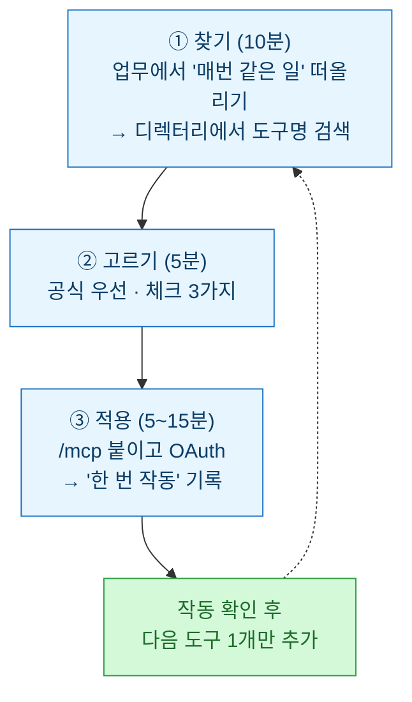
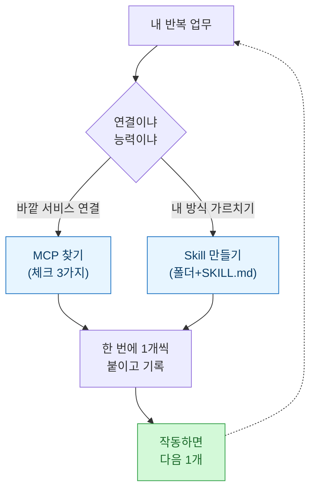

> 이건 강의 후기가 아니라 **캠프가 끝난 그 다음 날의 기록**이다. 4박 5일 동안 배운 건 많았는데, 정작 집에 오니 "그래서 이제 뭘 하지"에서 한참을 멈춰 있었다. 그 막막함을 어떻게 지도로 바꿨는지의 이야기.

## 캠프에선 두 개밖에 못 붙였다

4박 5일 AI 캠프에서 실제로 내 손으로 붙여본 도구는 노션과 슬랙, 딱 둘이었다. 강의는 좋았다. AI 에이전트를 트리거·처리·출력 3단으로 보는 프레임, 모델·도구·컨텍스트·환경 4부품, MCP를 "AI의 USB-C"라고 부르던 비유까지 — 머리로는 그림이 그려졌다.

문제는 집에 와서였다. 노트북을 열고 "자, 이제 내 시스템을 만들어보자" 했는데, 커서만 깜빡였다. 강의 슬라이드엔 길이 다 있었는데, 정작 **내 업무에 뭘 붙일지**는 내가 정해야 했다. 그리고 MCP 생태계엔 이미 3,000개가 넘는 커넥터가 있다고 했다. 3,000개. 여기서 딱 멈췄다.

## 진짜 병목은 '기술'이 아니라 '선택'이었다

붙이는 건 어렵지 않았다. 캠프에서 배운 대로 `/mcp` 치고, OAuth 팝업 누르면 됐다. 진짜 어려운 건 **3,000개 중에 뭘 고르냐**였다. 감으로 인기 있어 보이는 걸 하나씩 눌러보다가, 반나절을 그냥 태웠다.

명색이 "내 업무를 자동화하겠다"고 4박 5일을 쓴 사람인데, 정작 도구 하나 고르는 데서 멈춰 있는 게 좀 우스웠다. 그래서 마음먹었다. **매번 헤매지 않도록, 고르는 절차 자체를 고정해두자.**

## MCP랑 Skills, 뭐가 다른지부터 다시 정리했다

먼저 헷갈렸던 것부터. 캠프에선 둘 다 나왔는데 집에 오니 경계가 흐려졌다. 한 줄로 다시 못 박았다.

| 구분 | 한 줄 정의 | 언제 쓰나 |
| --- | --- | --- |
| **MCP** | 외부 도구를 AI에 **연결**하는 통로 ("AI의 USB-C") | 노션·슬랙·깃허브 같은 **바깥 서비스**를 붙일 때 |
| **Skills** | 폴더 1개 + `SKILL.md` 1개로 AI의 **능력 자체**를 추가 | 내 업무 방식·용어·템플릿을 **매번 설명 안 하고** 기억시킬 때 |

이렇게 갈라놓으니 선택이 쉬워졌다. **"바깥 것을 연결"하고 싶으면 MCP를 찾고, "내 방식을 가르치고" 싶으면 Skill을 만든다.** 이 한 줄이 그 뒤 모든 판단의 갈림길이 됐다.

## 그래서 만든 3단계 — 찾기, 고르기, 적용

헤매던 과정을 절차로 굳혔다. 다음부터는 이 순서만 따른다.

특히 **고르기 단계의 체크 3가지**가 반나절을 5분으로 줄여줬다.

| 체크 | 기준 | 왜 |
| --- | --- | --- |
| ⭐ 인기 | GitHub Stars 500+ 또는 디렉터리 상위 | 실제로 쓰이는 것 |
| 🕐 최신성 | 최근 1~2개월 내 업데이트 | 죽은 프로젝트 거르기 |
| 📖 문서 | README에 사용 예시 명확 | 붙이고 나서 안 헤매기 |

그리고 규칙 하나 — **한 번에 하나만.** 욕심내서 여러 개를 동시에 붙이면, 뭐가 문제인지 디버깅이 지옥이 된다. 이건 캠프에서도, 집에서도 똑같이 확인했다.

## 막히는 지점은 늘 똑같았다

붙이다 막힌 것도 결국 몇 가지로 수렴했다. 미리 알았으면 덜 헤맸을 것들.

| 증상 | 대응 |
| --- | --- |
| OAuth 실패 | 시크릿 모드 말고 **일반 브라우저**로 |
| 권한 부족 | 도구 쪽에서 페이지·채널 권한 추가 |
| 데이터 0개 | 인증 때 페이지 선택 누락 → 재인증 |
| 명령 오타 | 타이핑 말고 **붙여넣기** (오타 흔함) |

비개발자 입장에서 제일 자주 걸린 건 OAuth였다. 시크릿 창에서 인증하려다 계속 실패하고, "내가 뭘 잘못했나" 자책하던 게 알고 보니 브라우저 문제였다. 이런 건 기술이 아니라 **경험치의 문제**라, 한 번 겪고 적어두면 다시는 안 막힌다.

## 그래서 남은 건 '지도' 한 장

캠프가 준 건 재료였고, 집에서 만든 건 **순서**였다. 3,000개 앞에서 다시 마비되지 않도록, 내 업무 → 도구 카테고리 → 선택 기준으로 이어지는 지도를 그려뒀다.

솔직히 캠프 직후엔 "많이 배웠다"는 뿌듯함과 "근데 뭐부터 하지"라는 막막함이 반반이었다. 뜯어보고 나니 알았다 — **막막함의 정체는 지식 부족이 아니라 선택 기준의 부재였다.** 기준을 세우고 나니, 도구는 그냥 하나씩 붙이면 되는 일이 됐다.

## 마무리 — 캠프는 끝났지만 시스템은 이제 시작

배운 걸 그대로 두면 슬라이드로 남지만, 내 언어로 다시 뜯으면 도구가 된다. 이번에 만든 3단계와 지도는 다음에 새 MCP를 붙일 때마다 다시 꺼내 쓸 생각이다. 다음 글에서는 이 지도를 따라 **실제로 내 업무 하나를 Lv.1에서 Lv.2로 올린 과정**을 이어서 써보려 한다.

## 참고 · 방법 메모

- 선택 절차: 찾기(10분·디렉터리 검색) → 고르기(5분·인기/최신성/문서 체크 3가지, 공식 우선) → 적용(5~15분·`/mcp`·OAuth·"한 번 작동" 기록). 한 번에 1개씩.
- MCP 디렉터리: mcp.so · MCP.Directory · mcpservers.org / GitHub 큐레이션(punkpeye·wong2 awesome-mcp-servers)
- Skills: Anthropic 공식 가이드 PDF · anthropics/skills(공식 17개) / 한국어 입문: CC101, High Output Club, gpters
