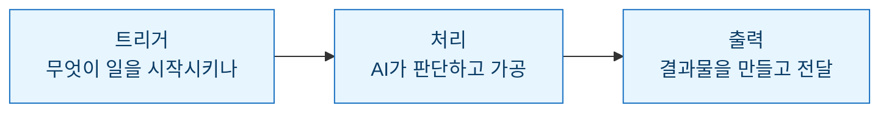
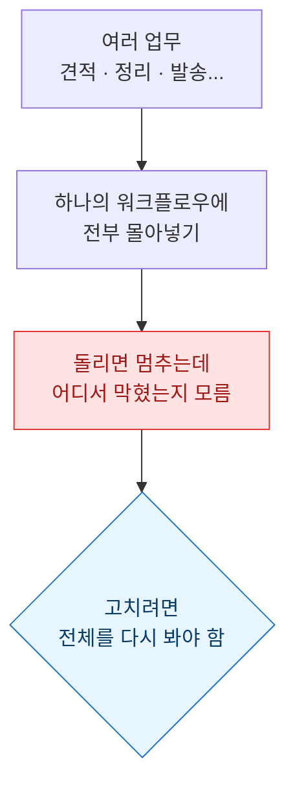
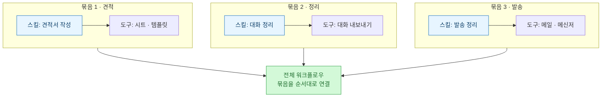

> 이건 '자동화 성공기'가 아니라 **한 번 크게 헤맨 기록**이다. 처음엔 내 업무 전부를 한 방에 자동화하려 했고, 정확히 그 욕심 때문에 막혔다. 어떻게 구조를 다시 봤고, 무엇을 '묶음'으로 쪼갰는지의 이야기.

## 먼저 기본 구조부터 다시 이해했다

클로드 코드로 업무를 자동화하겠다고 마음먹고 가장 먼저 한 건, 코드가 아니라 **구조를 보는 눈**을 맞추는 일이었다. 어떤 자동화든 결국 세 토막으로 나뉜다.

트리거는 "언제 시작하냐", 처리는 "그 사이에 무슨 판단이 일어나냐", 출력은 "무엇이 남냐"다. 이 세 칸으로 내 업무를 바라보니, 막연하던 "자동화"가 갑자기 **채워야 할 빈칸**으로 보이기 시작했다.

## 그다음, 병목을 찾았다

구조가 잡히자 질문이 바뀌었다. "뭘 자동화할까"가 아니라 **"내 일에서 매번 똑같이 반복되고, 매번 나를 붙잡는 지점이 어디냐"**. 그게 병목이다.

일을 트리거·처리·출력으로 쪼개 놓고 하나씩 짚어보니, 시간을 잡아먹는 구간이 눈에 들어왔다. 자동화는 일 전체를 없애는 게 아니라 **이 병목 한 칸을 대신 처리해 주는 것**이라는 걸, 이때 몸으로 이해했다.

## 처음엔 '하나의 워크플로우'에 전부 몰아넣었다

여기서 내가 크게 헛발을 디뎠다. 병목이 여러 개 보이니까, 욕심이 났다. 견적서 만들기, 대화 내보내서 정리하기, 결과 발송하기 — 이걸 **하나의 워크플로우로 한 번에 다 해결하려고** 설계했다.

결과는 예상대로였다. 돌리면 어딘가에서 멈추는데, **어디서 왜 막혔는지를 알 수가 없었다.** 여러 일이 한 덩어리로 엉켜 있으니, 문제 하나를 고치려면 전체를 다 들쑤셔야 했다.

돌아보면 이건 기술 문제가 아니라 **업무 설계의 오류**였다. 성격이 다른 일들을 구분 짓지 않고 한 흐름에 욱여넣은 것. 사람이 해도 헷갈릴 일을, AI에게 한 번에 시킨 셈이었다.

## '스킬 + 도구 = 묶음' 단위로 다시 쪼갰다

그래서 설계를 뒤집었다. 전체를 한 번에 짜지 않고, **작은 묶음 하나부터** 만들기로 했다.

묶음 하나의 정의는 단순했다 — **스킬 하나 + 그 스킬이 쓰는 도구**. 예를 들어 '견적서 작성'이라는 스킬에 그에 필요한 도구를 붙이면, 그게 독립적으로 돌아가는 묶음 1이 된다. '대화 정리'는 또 다른 묶음 2. 각 묶음은 혼자서도 완결되니, 막히면 그 묶음만 열어보면 된다.

그리고 이 묶음들을 **서로 연결해서** 전체 워크플로우를 만들었다. 한 덩어리를 쪼갠 게 아니라, 검증된 조각을 이어 붙여 큰 그림을 세운 것이다.

효과는 바로 나타났다. 어딘가 멈추면 **어느 묶음인지 즉시 짚였고**, 그 묶음만 고치면 됐다. 전체를 다시 볼 일이 사라졌다.

| 처음 설계 | 다시 짠 설계 |
| --- | --- |
| 여러 업무를 한 워크플로우에 | 업무마다 묶음 하나씩 |
| 막히면 전체를 뒤짐 | 막힌 묶음만 열어봄 |
| 검증이 통째로 | 묶음 단위로 검증 |
| 확장하려면 재설계 | 묶음 하나만 추가 |

## 스킬 최적화로 자동화를 마무리했다

묶음 단위로 돌아가기 시작하자, 마지막 남은 일은 **각 스킬을 다듬는 것**이었다. 처음엔 매번 내가 맥락을 설명해 줘야 움직이던 스킬들을, 자주 막히는 지점과 반복되는 지시를 스킬 안에 적어 넣어 **말 한마디에 스스로 돌아가게** 만들었다.

여기까지 오니 비로소 '자동화'라는 말이 실감 났다. 트리거를 당기면 묶음들이 알아서 이어지고, 내가 손대는 구간은 확인뿐이었다. 큰 걸 한 번에 세우려다 무너졌던 게, **작은 묶음을 검증하며 쌓으니** 오히려 튼튼하게 섰다.

## 마무리 — 자동화는 '크게'가 아니라 '작게 나눠서'

이번에 제일 크게 배운 건 기술이 아니라 태도다. **한 번에 다 하려는 욕심이 가장 큰 병목이었다.** 트리거·처리·출력으로 구조를 보고, 병목을 찾고, 스킬+도구를 묶음으로 쪼개 하나씩 검증하고, 그걸 연결해 전체를 세운다 — 이 순서는 다음 업무를 자동화할 때도 그대로 다시 꺼내 쓸 생각이다.

다음 글에서는 이 방식으로 **실제 업무 하나를 처음부터 끝까지 묶음으로 설계한 과정**을 이어서 써보려 한다.

## 참고 · 방법 메모

- 구조 보는 틀: 트리거(언제 시작) → 처리(무슨 판단) → 출력(무엇이 남나)
- 설계 원칙: 여러 업무를 한 워크플로우에 몰지 않는다. **스킬 1 + 도구 = 묶음 1**, 묶음을 연결해 전체를 만든다.
- 디버깅 이점: 묶음 단위라 막힌 곳이 바로 짚이고, 그 묶음만 고치면 된다.
- 마무리: 자주 막히는 지점·반복 지시를 스킬에 적어 넣어 최적화 → 말 한마디로 실행.
