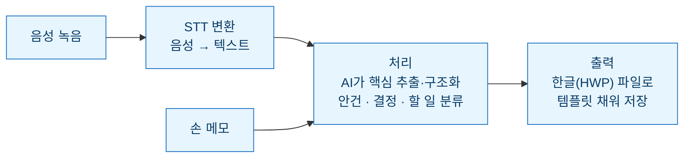

> 이 글은 '자동화 성공기'가 아니다. **아직 돌려보기 전, 설계 단계의 기록**이다. 회의록 자동 작성을 만들기로 하고, 코드보다 먼저 설계를 글로 굳혀 봤다. 무엇을 받고, 무엇을 판단하고, 무엇을 뱉을지 — 그리고 어디서 막힐 것 같은지까지.

## 왜 회의록부터인가

회의록은 자동화하기 좋은 일이다. **매번 비슷한 구조인데, 매번 시간을 먹기** 때문이다. 참석자, 안건, 결정사항, 후속 할 일 — 틀은 늘 똑같은데, 회의가 끝나면 기억을 더듬어 다시 정리하느라 30분씩 쓴다. 틀이 일정하다는 건 곧 **기계가 채우기 좋다**는 뜻이다.

그래서 정했다. 회의록 작성을, 내가 처음부터 끝까지 쓰는 일이 아니라 **AI가 초안을 채우고 내가 확인·보완하는 일**로 바꾸자.

## 설계 — 트리거·처리·출력으로 나누기

먼저 일을 세 토막으로 쪼갰다. 자동화를 볼 때 늘 쓰는 틀이다.



- **트리거(입력)** — 회의가 끝나면 남는 두 가지 재료. 하나는 **음성 녹음을 STT로 텍스트화한 파일**, 다른 하나는 회의 중 급히 적은 **손 메모**. 녹음은 전체 맥락을, 메모는 내가 중요하다고 판단한 지점을 담고 있어, 둘을 함께 넣으면 서로를 보완한다.
- **처리(판단)** — AI가 두 재료를 합쳐 핵심을 뽑고 **안건 / 결정사항 / 후속 할 일(담당·기한)** 로 분류한다. 잡담과 결론을 가려내는 게 핵심.
- **출력(형식)** — 정해진 회의록 템플릿을 채워 **한글(HWP) 파일**로 저장한다. 보관 문서 형식을 한글로 통일하기 위해, 결과물도 이 형식이어야 한다.

## 그래서 스킬 두 개를 먼저 설치해야 한다

이 설계가 돌아가려면, AI 혼자로는 안 되고 **능력 두 개를 스킬로 붙여야** 한다. 앞 글에서 정리한 "바깥 것을 연결하거나, 없는 능력을 스킬로 더한다"는 원칙 그대로다.

| 필요 능력 | 왜 | 형태 |
| --- | --- | --- |
| **음성 STT** | 녹음 파일을 텍스트로 바꿔야 AI가 읽음 | STT 처리 스킬/도구 |
| **한글(HWP) 출력** | 결과를 사내 표준 포맷으로 저장 | 한글 파일 생성 스킬 |

즉 파이프라인의 **양 끝**에 스킬이 하나씩 붙는다. 입력 쪽엔 음성을 글로 바꾸는 STT, 출력 쪽엔 글을 한글 파일로 굳히는 HWP 생성. 가운데(요약·분류)는 AI가 맡고, 양 끝의 형식 변환을 스킬이 책임지는 구조다. 이 두 스킬 설치가 사실상 이 자동화의 **선행 조건**이다.

## 예상 출력 — 목표 형태를 먼저 그린다

만들기 전에 **결과물이 어떻게 생겼으면 하는지**부터 정했다. 목표가 뚜렷해야 처리 단계를 어디까지 시킬지 정해진다. 대략 이런 형태를 노린다.

```
# [회의 제목] 회의록
- 일시 / 참석자
## 안건
1. …
2. …
## 결정사항
- …
## 후속 할 일 (Action Items)
- [담당자] 할 일 — 기한
## 논의 메모
- (근거·배경이 되는 대화 요약)
```

핵심은 **"후속 할 일"에 담당자와 기한이 반드시 붙는 것**이다. 회의록에서 실제로 다시 꺼내 보는 건 결국 이 부분이라, 여기가 비면 자동화의 의미가 없다.

## 미리 짚어둔 위험 — 어디서 막힐 것 같은가

아직 안 돌려봤지만, 앞선 자동화 경험을 떠올리면 막힐 지점이 눈에 보인다. 미리 적어두면 그만큼 덜 헤맨다.

| 예상 위험 | 왜 생기나 | 대비 |
| --- | --- | --- |
| 잡담을 결정으로 오해 | AI가 "~하면 좋겠다"를 결정으로 승격 | '확정 표현'만 결정에 넣도록 규칙화 |
| 담당·기한 누락 | 대화에 명시가 없으면 비움 | 비면 "미정"으로 표시해 눈에 띄게 |
| 형식이 매번 흔들림 | 그때그때 자유롭게 생성 | 템플릿을 고정 명세로 못 박기 |

특히 두 번째, **담당·기한 누락**이 제일 위험하다. 회의록에서 실제로 다시 꺼내 보는 건 결국 "누가 언제까지"인데, 대화에 명시가 없다고 AI가 슬쩍 비워두면 그 항목은 사라진 셈이 된다. 그래서 비는 칸은 없애지 말고 **"미정"으로 남겨** 눈에 띄게 하는 걸 규칙으로 뒀다.

## 검증 계획 — 어떻게 '믿을 수 있나'를 확인할까

성공 회고가 없으니, 대신 **어떻게 검증할지**를 미리 정했다.

1. **같은 회의 메모로 3번 돌려** 결과가 크게 흔들리지 않는지 (형식 안정성)
2. **내가 직접 쓴 회의록과 나란히 놓고** 빠진 결정·할 일이 없는지 대조
3. **후속 할 일의 담당·기한 정확도**만 따로 체크 (여기가 제일 중요하니까)

이 셋을 통과하면 그때 "쓸 만하다"고 판단하고, 통과 못 하면 처리 규칙을 고쳐 다시 돌린다.

## 마무리 — 만들기 전에 글로 굳히는 이유

코드부터 짜고 싶은 마음을 누르고 설계를 먼저 글로 적은 건, 앞선 자동화들에서 배운 게 있어서다. **한 번에 다 만들려다 어디서 막혔는지도 모르고 헤맸던** 경험. 설계를 미리 쪼개 두면, 나중에 막혀도 "트리거냐 처리냐 출력이냐"로 금방 좁혀진다.

다음 글에서는 이 설계를 **실제로 돌려본 뒤의 회고** — 예상이 맞았는지, 어디서 틀렸는지 — 를 이어서 쓰려 한다. 그때는 이 글이 좋은 비교 기준이 될 것이다.

## 참고 · 방법 메모

- 설계 틀: 트리거(음성 STT 파일 + 손 메모) → 처리(안건·결정·할 일 분류) → 출력(고정 템플릿 채워 한글 파일 저장).
- 선행 조건: 입력용 **STT 스킬**, 출력용 **한글(HWP) 생성 스킬** 두 개 설치.
- 출력 원칙: '후속 할 일'에 담당·기한 필수, 없으면 "미정" 표기.
- 검증: 반복 안정성 · 내 초안과 대조 · 할 일 정확도 3종 통과 후 사용.
