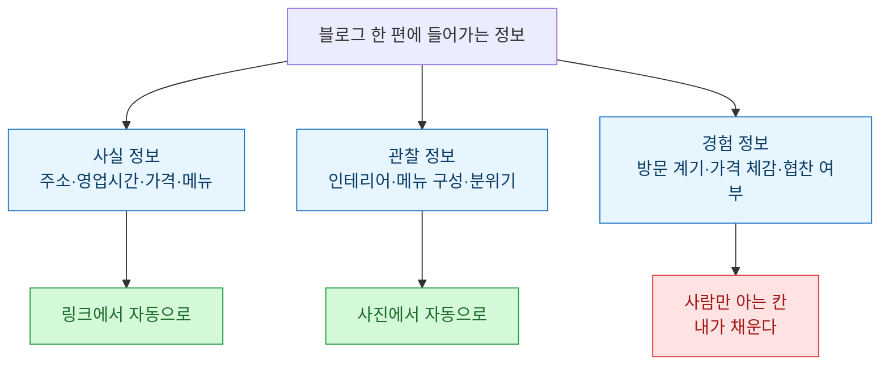
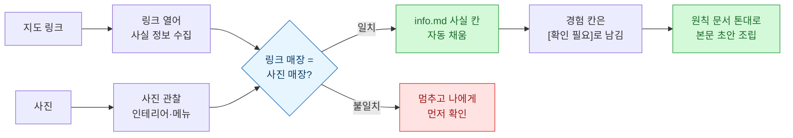
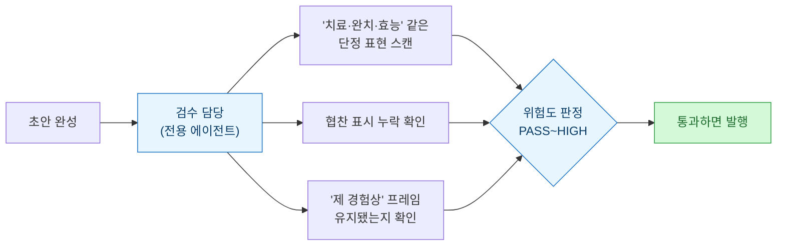

> 이건 '완전 자동 발행기'를 만든 이야기가 아니다. 오히려 **어디까지가 자동이고 어디부터는 내가 해야 하는지, 그 선을 긋는 이야기**에 가깝다. 사진이랑 지도 링크만 던지면 초안이 나오게 만들었는데, 끝까지 안 없어지는 칸이 있더라.

## 왜 시작했나 — 조립이 매번 노동이었다

네이버 블로그에 맛집·카페 글을 올릴 때마다, 정작 힘든 건 글재주가 아니라 **조립**이었다. 위치·영업시간·메뉴 가격을 지도에서 찾아 옮기고, 사진을 순서대로 끼우고, 매번 같은 "기본 정보 표"를 다시 그리고, 해시태그를 조합하고. 톤은 이미 내 안에 있는데, 그 톤을 담는 **틀을 채우는 일**이 매번 나를 붙잡았다.

그래서 마음먹었다. 내 문체와 구조는 문서로 한 번 못 박아두고, **기계적인 조립만 덜어내자**. 글을 대신 써주는 게 아니라, 내가 손으로 반복하던 칸을 대신 채우게 만드는 것.

## 그래서 뭘 자동에 맡길지부터 갈랐다

먼저 한 일은 코드가 아니라 **분류**였다. 한 편의 글에 들어가는 정보를 성격으로 나눠보니 딱 세 종류였다.

사실 정보는 지도 링크에 다 있고, 관찰 정보는 사진에 다 있다. 문제는 세 번째 — **왜 갔는지, 얼마가 비싸게 느껴졌는지, 협찬인지 자비인지**는 링크에도 사진에도 없다. 이 경계선이 이 시스템의 전부다.

## 재료는 딱 두 개 — 사진, 그리고 지도 링크

그래서 입력을 최대한 얇게 만들었다. 장소마다 폴더 하나를 파고, 그 안에 넣는 건 두 가지뿐이다.

- `photos/` — 찍은 사진 원본 (순서도, 파일명도 상관없음)
- `info.md` — 맨 위에 **네이버 지도 링크 한 줄**만 붙여넣기

나머지 사실 항목(주소·영업시간·카테고리·인기메뉴)은 비워둔다. 채우는 건 내 몫이 아니라 다음 단계의 몫이니까.

## 파이프라인 — 링크를 열고, 사진이랑 대조하고, 초안을 조립한다

"이 폴더 채워줘" 한마디면 아래 순서가 돈다.

핵심은 가운데 갈림길이다. **링크가 가리키는 가게와 사진 속 가게가 같은 곳인지 먼저 대조**하고, 어긋나면 자동으로 채우지 않고 나한테 먼저 묻는다. 이 안전장치가 왜 필요했는지는 다음 섹션이 설명한다.

## 자동화가 오히려 '내 틀린 걸' 잡아준 순간

자동화를 붙이고 제일 의외였던 건, 시간이 줄어든 것보다 **내가 틀린 걸 잡아준 것**이었다. 강릉 과일 찹쌀떡집 글을 만들 때 이런 일이 있었다.

| 내가 적은 것 | 대조해서 잡힌 것 | 근거 |
| --- | --- | --- |
| "속초 중앙시장" | → **강릉** 중앙시장 | 지도 링크의 주소가 강릉 |
| "전 메뉴 비건" | → 과일 찹쌀떡만 비건, **크림치즈·앙버터는 유제품** | 원산지 표시 대조 |
| 사진 = 이 가게 | → 동명 매장일 수 있음, 확인 요청 | 인테리어·메뉴 구성 대조 |

세 번째가 특히 그랬다. 네이버 지도는 **같은 이름의 다른 가게**가 여러 개 걸릴 수 있어서, 한 번은 링크가 가리키는 곳과 사진 속 매장이 실제로 달랐던 적이 있다. 사람이 급하게 하면 그냥 지나칠 것들을, 링크와 사진을 기계적으로 대조하니 오히려 걸러졌다. 자동화의 값어치가 "빨라짐"이 아니라 **"덜 틀림"** 쪽에서 나온 셈이다.

## 그래도 끝까지 '내가 채워야 하는 칸'이 남는다

그렇다고 전부 자동이 되진 않았다. 아무리 링크·사진을 뒤져도 안 나오는 칸이 있고, 이건 남겨두는 게 맞았다. 시스템은 이런 항목을 지어내지 않고 `[확인 필요]`로 비워둔 채 나한테 되묻는다.

| 자동으로 채워지는 칸 | 끝까지 내가 채우는 칸 |
| --- | --- |
| 주소 · 영업시간 · 카테고리 | 방문 계기 (왜 갔나) |
| 메뉴판 가격 · 인기메뉴 | 가격 체감 (영수증 없인 부정확) |
| 인테리어 · 좌석 구성 | 실제로 뭘 주문·시식했는지 |
| 가까운 역 · 도보 시간 | **협찬 / 체험단 / 자비 여부** |

맨 아랫줄이 제일 중요하다. 협찬인지 아닌지는 사진에도 링크에도 없지만, **표시광고법상 반드시 밝혀야 하는 정보**다. 이런 건 자동화가 대신 판단하면 안 되는 칸이라, 일부러 사람에게 남겼다. 실제로 그 찹쌀떡집 글에서도 음료 가격과 화·수 정기휴무는 링크에 정보가 없어서 `[확인 필요]`로 남겨두고, 확인될 때까지 본문에 넣지 않았다.

## 발행 직전엔 '검수 담당'을 하나 더 뒀다

내 블로그는 건강·염증 이야기를 곁들이는 톤이라, 구글 기준으로 보면 **YMYL(건강·의료) 콘텐츠**에 가깝다. 여기서 "이 성분이 염증을 없애준다" 같은 문장을 무심코 쓰면 표시광고법·의료법에 걸릴 수 있다. 그래서 본문 조립과 **검수를 아예 분리**했다.

이 검수 담당은 문체를 손대지 않는다. 오직 **의학적 단정과 법적 리스크만** 본다. "완치됐다"는 플래그하지만 "제 경험상 저는 편했어요"는 오히려 신뢰 신호라 그대로 둔다. 글쓰기와 리스크 점검은 성격이 다른 일이라, 한 사람(한 프롬프트)에게 다 시키지 않고 갈라둔 것이다.

## 그래서 남은 건 '경계선' 한 장

만들고 나서 손에 남은 건 대단한 자동화 기계가 아니라, **선 하나**였다.

- 사실은 링크가 채운다.
- 관찰은 사진이 채운다.
- 경험과 책임(협찬·건강 표현)은 내가 채운다.

이 선을 그어두니, "어디까지 믿고 맡길까"로 매번 고민하던 게 사라졌다. 자동화는 일을 통째로 삼키는 게 아니라, **삼켜도 되는 부분과 삼키면 안 되는 부분을 갈라주는 작업**이었다. 그 경계를 명확히 한 만큼, 남은 내 몫도 오히려 선명해졌다.

## 마무리 — '전부 자동'을 포기하니 오히려 쓸 만해졌다

처음엔 사진만 넣으면 발행까지 되는 걸 상상했다. 하지만 방문 계기도, 협찬 여부도 모르는 채 발행되는 글은 내 글이 아니다. `[확인 필요]`라는 빈칸을 남기기로 하고 나서야, 이 시스템은 비로소 **믿고 쓸 수 있는 초안기**가 됐다. 다음 글에서는 이 파이프라인으로 실제 한 편을 처음부터 끝까지 뽑는 과정을, 폴더 상태 그대로 이어서 써보려 한다.

> ⚠️ 이 시스템은 내가 직접 찍은 사진과 내가 받은 지도 링크만 재료로 쓴다. 없는 후기나 안 가본 곳을 지어내지 않고, 확인 안 된 정보는 `[확인 필요]`로 비워둔다.

## 참고 · 방법 메모

- 입력: 장소 폴더 하나 = `photos/`(사진 원본) + `info.md`(지도 링크 한 줄).
- 자동 채움: 링크→사실 정보, 사진→관찰 정보. **링크 매장과 사진 매장이 같은지 대조**한 뒤 채우고, 어긋나면 멈추고 사용자에게 확인.
- 사람이 남기는 칸: 방문 계기 · 가격 체감 · 주문 내용 · **협찬/체험단 여부** → `[확인 필요]`.
- 조립: 문체·구조·해시태그 규칙은 원칙 문서 한 장으로 고정, 초안은 그 틀대로 조립.
- 검수: 발행 직전 전용 검수 담당이 의료법·표시광고법 단정 표현만 별도로 점검(문체는 손대지 않음).
