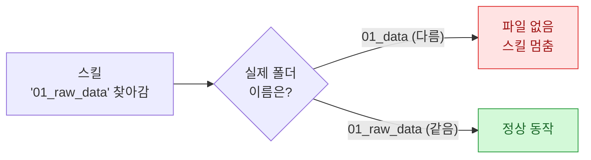
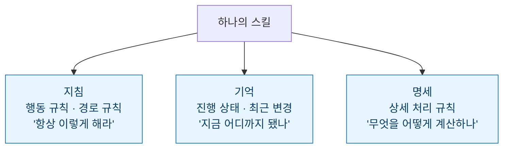

> 자동화를 하다 보면 알게 된다. 무너지는 건 늘 거창한 데서가 아니라 **사소한 데서**다. 폴더 이름 하나, 지우지 않은 옛 폴더 하나. 이건 그 사소함에 세 번 데이고, 결국 구조로 막은 기록이다.

## 폴더 이름 하나가 스킬을 멈췄다

잘 돌던 자동화 스킬이 어느 날 갑자기 "파일을 찾을 수 없다"며 멈췄다. 코드는 한 줄도 안 건드렸는데. 한참을 들여다보고 나서야 원인을 찾았다 — **폴더 이름이었다.**

스킬은 특정 경로에 데이터가 있다고 믿고 그 자리를 찾아가는데, 어느 순간 내가 폴더 이름을 조금 다르게 써 둔 게 화근이었다. 사람 눈엔 거의 같아 보이는 이름이지만, 스킬에겐 완전히 다른 주소였다.

교훈은 단순했다. **사람이 대충 맞춰 읽는 이름을, 기계는 글자 그대로 읽는다.** 그래서 경로와 폴더 이름을 내 마음대로 짓지 않고, 규칙을 하나 정해 통일했다. 이름 짓는 자유를 포기한 대신, 스킬이 길을 잃는 일이 사라졌다.

## 구버전이 쌓이니 AI가 헷갈렸다

다음 사고는 반대 방향이었다. 이번엔 스킬이 멈추지 않았다. **엉뚱한 파일을 참조해서 조용히 이상한 결과를 냈다.**

원인은 정리하지 않은 **구버전 폴더**였다. 새 버전을 만들면서 옛날 폴더를 지우지 않고 그냥 옆에 뒀더니, 비슷한 이름의 폴더가 여러 개가 됐다. 스킬은 그중 하나를 골라 참조했는데, 하필 옛날 것을 집은 것이다. 멈췄으면 차라리 금방 알았을 텐데, 조용히 틀리니 더 위험했다.

| 상황 | 증상 | 위험도 |
| --- | --- | --- |
| 폴더 이름 불일치 | 스킬이 **멈춤** (에러) | 바로 눈치챔 |
| 구버전 폴더 잔존 | 스킬이 **조용히 틀림** | 한참 뒤에 발견 |

이때 규칙을 하나 더 세웠다. **새 버전을 만들면 옛 버전은 그 자리에서 지운다.** "혹시 나중에 쓸까 봐" 남겨둔 폴더가, 실제로는 자동화를 오염시키는 지뢰였다.

## 두 사고의 원인은 사실 같았다

폴더 이름과 구버전 — 증상은 달랐지만 뿌리는 하나였다. **내가 스킬을 '그때그때 감으로' 관리하고 있었다는 것.** 어디에 뭐가 있는지, 뭐가 최신인지, 스킬이 무엇을 믿고 도는지가 내 머릿속에만 있었다. 머릿속 규칙은 바쁘면 흔들리고, 흔들리면 자동화가 무너졌다.

그래서 감으로 하던 걸 **바깥으로 꺼내 문서로 고정**하기로 했다.

## 그래서 스킬을 문서 3종으로 나눴다

스킬 하나를 세 개의 문서로 쪼갰다. 각자 역할이 분명하다.

- **지침** — 스킬이 항상 지켜야 할 규칙. 경로·폴더 이름 규칙을 여기 못 박아, 앞의 첫 번째 사고를 원천 차단했다.
- **기억** — 지금 어디까지 됐는지, 뭘 바꿨는지의 기록. 어떤 게 최신인지가 명확해져, 두 번째 사고(구버전 혼동)가 사라졌다.
- **명세** — 실제 처리 규칙. 무엇을 어떤 순서로 계산하는지의 상세. 로직이 여기 고정돼 있으니, 감으로 바뀔 일이 없다.

| 문서 | 한 줄 역할 | 막아준 사고 |
| --- | --- | --- |
| 지침 | 항상 지킬 규칙 (경로·이름 포함) | 폴더 이름 불일치 |
| 기억 | 진행 상태·최신 버전 기록 | 구버전 혼동 |
| 명세 | 상세 처리 규칙 | 로직이 감으로 흔들림 |

세 문서로 나눈 뒤로, 스킬은 내 기억력에 기대지 않게 됐다. 규칙은 지침에, 최신 상태는 기억에, 계산법은 명세에 있으니, 내가 바빠도 스킬은 흔들리지 않았다.

## 마무리 — 자동화의 안정성은 '문서'에서 나온다

돌아보면 나를 괴롭힌 건 어려운 기술이 아니라 **관리의 부재**였다. 폴더 이름 하나, 남은 폴더 하나 같은 사소한 것들이 자동화를 무너뜨렸고, 그걸 막은 것도 대단한 코드가 아니라 **문서 세 장**이었다.

자동화를 '만드는 법'은 많이 이야기되지만, '무너지지 않게 관리하는 법'은 덜 이야기된다. 나에겐 그 답이 지침·기억·명세였다. 다음에 새 스킬을 만들 때도, 코드보다 이 세 문서를 먼저 열 생각이다.

## 참고 · 방법 메모

- 사고 1: 경로·폴더 이름을 감으로 지어 스킬이 파일을 못 찾음 → **이름 규칙 통일**로 해결.
- 사고 2: 구버전 폴더를 안 지워 스킬이 옛 파일을 참조 → **새 버전 만들면 옛 버전 즉시 삭제** 규칙.
- 공통 원인: 스킬 관리가 머릿속에만 있었음 → 문서로 외부화.
- 해결 구조: 스킬 1개 = **지침(규칙) + 기억(상태) + 명세(로직)** 세 문서.
