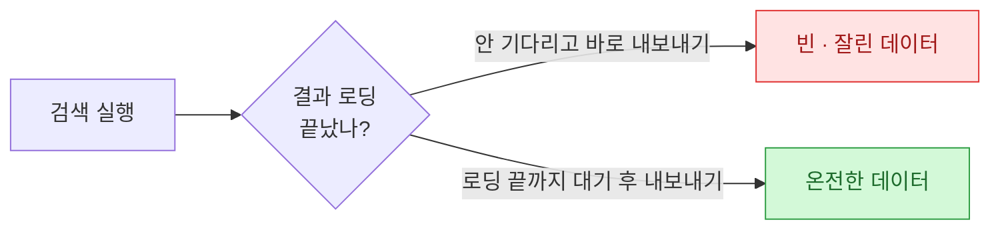
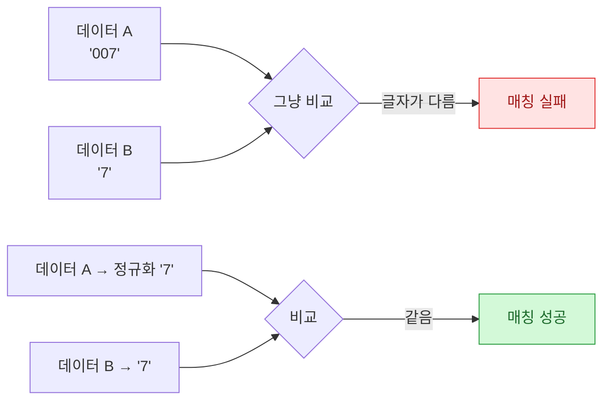

> 자동화를 만들면서 시간을 가장 많이 잡아먹은 건 거창한 로직이 아니었다. **사소한 함정 세 개**였다. 셋 다 "이 정도면 되겠지" 하고 넘긴 지점에서 터졌고, 셋 다 같은 교훈으로 끝났다. 나처럼 시간 태우지 말라고 남기는 기록.

## 함정 1 — 빈 데이터의 범인은 '기다림'이었다

가장 먼저 나를 괴롭힌 건 **빈 데이터**였다. 자동화를 돌리면 어떤 날은 멀쩡한데, 어떤 날은 결과가 텅 비거나 절반만 담겼다. 코드는 그대로인데 결과가 들쭉날쭉하니 미칠 노릇이었다.

원인은 **타이밍**이었다. 화면에서 검색을 누르면 결과가 다 뜨기까지 몇 초가 걸리는데, 자동화는 그걸 안 기다리고 곧장 "내보내기"를 눌러버렸다. 사람이라면 결과가 다 뜬 걸 눈으로 보고 눌렀을 텐데, 기계는 화면이 준비됐는지 모르고 정해진 순서대로만 달린 것이다.

해결은 단순했다. "내보내기" 전에 **결과가 다 로딩됐는지 확인하고, 끝날 때까지 기다린 뒤** 다음으로 넘어가게 했다. 자동화에서 순서만큼 중요한 게 **속도 맞추기**라는 걸 이때 배웠다. 기계는 나보다 빨라서, 오히려 기다리게 만들어야 했다.

## 함정 2 — 필터를 똑똑하게 걸었더니 오히려 에러났다

두 번째는 반직관적이었다. 데이터를 조회할 때 "필요한 범위만 딱 집어서 가져오면 더 깔끔하겠지" 싶어, 조회 조건을 최대한 구체적으로 좁혔다. 그런데 돌리자마자 **필수값 오류**가 나며 멈췄다.

한참을 헤매다 알았다. 그 화면은 범위를 **일부만 지정하면 오히려 "불완전한 입력"으로 판단**해서 거부했다. 조건을 아예 안 건드리고 **전체로 두는 게** 정상 동작이었다. 내 상식("좁힐수록 안전")과 시스템의 규칙("전체가 기본")이 정반대였던 것이다.

| 내 짐작 | 실제 | 결과 |
| --- | --- | --- |
| 범위를 좁힐수록 안전하다 | 일부만 지정하면 필수값 오류 | 멈춤 |
| 전체는 위험할 것 같다 | 전체가 정상 기본값 | 정상 동작 |

교훈은 이거였다. **내 상식으로 시스템을 넘겨짚지 말자.** 좁히는 게 늘 안전한 것도 아니고, 자동화는 그 시스템의 규칙을 그대로 따라야 한다. "이게 더 나을 것 같은데"는 확인 전까진 짐작일 뿐이었다.

## 함정 3 — 분명 같은 코드인데 매칭이 안 됐다

세 번째가 제일 얄미웠다. 두 데이터를 코드로 맞대어 연결하는 작업이었는데, 눈으로 보면 분명 같은 코드인데도 자동화는 "일치하는 게 없다"고 했다.

범인은 **앞자리 0**이었다. 한쪽은 코드를 `007`처럼 앞에 0을 붙여 저장했고, 다른 쪽은 `7`로 저장했다. 사람 눈엔 같은 번호지만, 기계에겐 글자가 다른 완전히 다른 값이었다.

해결은 **비교하기 전에 양쪽을 같은 형식으로 맞추는 것**. 앞자리 0을 떼서 기준을 통일한 뒤 비교하니 깔끔하게 매칭됐다. 데이터를 맞댈 땐 "같아 보이는 것"과 "실제로 같은 것"이 다르다는 것, 그래서 **비교 전 정규화**가 기본이라는 걸 몸으로 익혔다.

## 세 함정의 공통점

셋은 증상이 달랐지만 뿌리는 하나였다.

| 함정 | 증상 | 해결 |
| --- | --- | --- |
| 기다림 | 빈·잘린 데이터 | 로딩 끝까지 대기 후 진행 |
| 필터 | 필수값 오류로 멈춤 | 범위를 전체로 (시스템 규칙 따르기) |
| 앞자리 0 | 같은 코드인데 매칭 실패 | 비교 전 형식 정규화 |

공통점은 **"기계는 내 짐작대로 움직이지 않는다"**는 것이다. 나는 화면이 준비됐을 거라 짐작했고, 좁히는 게 안전할 거라 짐작했고, 같은 번호면 같은 값일 거라 짐작했다. 세 번 다 틀렸다. 자동화는 내 상식이 아니라 **시스템의 실제 규칙**을 따라야 했다.

## 마무리 — 사소한 함정이 시간을 가장 많이 태운다

돌아보면 이 세 가지는 어려운 문제가 아니었다. 한 번 겪고 원인을 알고 나면 다음부턴 5분이면 피할 것들이다. 문제는 **처음엔 원인이 안 보여서** 반나절씩 태운다는 거다. 그래서 적어둔다. 기다림, 필터, 앞자리 0 — 다음에 자동화가 이상하게 굴면, 나는 먼저 이 셋부터 의심할 생각이다.

## 참고 · 방법 메모

- 함정 1(타이밍): 화면 동작을 자동화할 땐 "다음 단계로 넘어가기 전에 이전 단계가 정말 끝났는지" 확인·대기.
- 함정 2(필터): 조회·입력 조건은 내 상식으로 좁히기 전에, 시스템이 요구하는 기본값을 먼저 확인.
- 함정 3(정규화): 두 데이터를 코드·키로 매칭할 땐 비교 전에 형식(앞자리 0, 공백, 대소문자 등) 통일.
- 공통: 자동화는 '짐작'이 아니라 '시스템의 실제 규칙'을 따른다.
